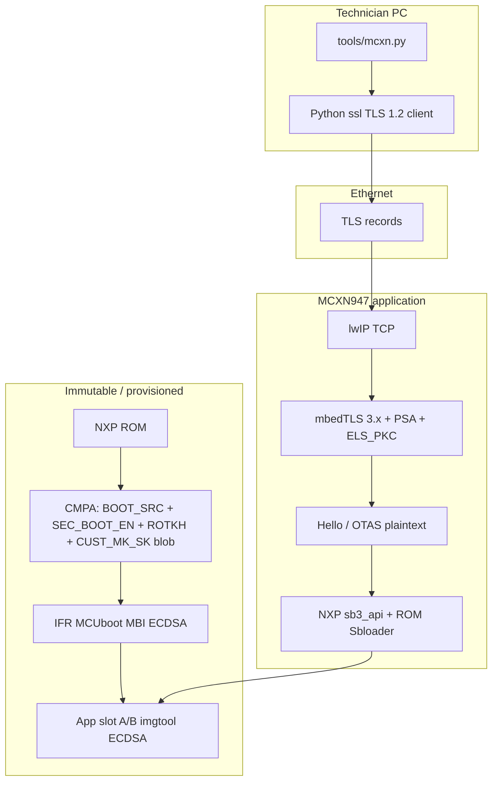

# FRDM-MCXN947 Secure Ethernet OTA — As-Built Firmware Bible

**Document type:** As-built technical bible (configuration item for independent QA)  
**Product:** FRDM-MCXN947 Secure Ethernet OTA prototype  
**Repository:** `c:\temp\mcxn947Test`  
**Unit under test:** `DEV-UNIT-01`  
**As-built date:** 2026-09-03  
**Authority of this file:** Describes **what was actually built, provisioned, and proven**. Plans in `doc/` are design authority for *intent*; this bible plus `docs/evidence/*` are authority for *as-built*. Where an older note conflicts (for example `docs/protocol-update.md` still describing a plaintext TCP transport), **this bible wins**.

---

## 0. How a third-party QA expert should use this document

Read in this order:

1. **§1–§3** — identity, scope, what is *not* claimed.  
2. **§4–§7** — hardware, boot chain, security layers, application protocols.  
3. **§8–§10** — firmware map, host tools, operator workflows.  
4. **§11–§14** — standards, algorithms, test evidence, residual risk.  
5. Open the named evidence file before repeating a gate; do not treat a plan checkbox as a pass.

**QA audit rules used on this project**

| Rule | As-built meaning |
|------|------------------|
| Secrets never in Git | Keys, PEM, `CUST_MK_SK`, CMPA binaries live under `C:\mcxn-secrets\`. Registry JSON stores fingerprints only. |
| Frozen security after P7 | No further CMPA / CFPA / IFR / lifecycle / fuse writes in the mTLS phase. |
| Transport ≠ authenticity | mTLS authenticates PC↔MCU *in transit*. Firmware authenticity and unit binding remain SB3.1 + `CUST_MK_SK` + MCUboot imgtool. |
| Dual-slot flash | LinkServer loads that replace a running image must program **both** remap-visible slots (`0x0` and `0x00100000`) unless OTA is used. |
| Wrong key = silent no-app | Signing an **application** slot with ROM/MBI `IMG1_1` produces empty UART and no ping. That is MCUboot reject, not a HardFault. |

---

## 1. System identity (as-built)

| Item | Value |
|------|--------|
| MCU | NXP MCXN947, CM33 core0 product firmware |
| Board | FRDM-MCXN947 |
| Probe | MCU-LINK CMSIS-DAP V3.128, serial `MNZW4VYTFX113` |
| VCOM | COM9 @ 115200 (RX proven; **TX semaphore timeout** — do not use serial XMODEM) |
| HS USB ISP | Connector **J11**, ROM HID `VID_1FC9` / `PID_014F` (proven) |
| MCU-Link USB | Connector **J17** |
| Silicon UUID | `9DA8D48D0DDCD755903E8FBD3836C153` (NXP `SILICONID_GetID`) |
| IPv4 (static, fleet policy) | `192.168.2.90/24`, gateway `192.168.2.24` |
| MAC (P0 ARP) | `54-27-8d-9d-a8-d4` |
| PHY | LAN8741 via NXP ENET (JP13 / R274 Ethernet path proven by ping) |
| Lifecycle | **Develop** (debug/ISP intentionally open) |
| Last proven application after M3 | **V3** `version=3.0.0 variant=V3` (live board may change; confirm with `STATUS`) |

**Branches / tags of record**

| Marker | Meaning |
|--------|---------|
| Plan Rev C FINAL | Secure Ethernet OTA autonomous agent plan (`doc/FRDM_MCXN947_SECURE_ETHERNET_UPDATE_AUTONOMOUS_AGENT_PLAN_REV_C_FINAL.md`) |
| `p7-frozen-mtls-baseline` @ `49c24af` | Security architecture frozen; mTLS work started from here |
| Branch `feat/mtls-tcp-socket` | Product mTLS on `:5000` and `:5555` |
| Plan Rev B FINAL | mTLS socket plan (`doc/FRDM_MCXN947_RELIABLE_MTLS_TCP_SOCKET_PLAN_REV_B_FINAL.md`) |

---

## 2. Purpose, scope, and explicit non-claims

### 2.1 What the as-built system does

1. Boots through **NXP ROM ECDSA-signed MBI** → **IFR MCUboot** → **imgtool-signed application** in a 1 MiB A/B DIRECT_XIP layout.  
2. Brings up **FreeRTOS + lwIP + ENET** with a **fixed static IP**.  
3. Offers **mutual TLS 1.2** on two TCP ports; after decrypt, application framing is still the original plaintext protocols.  
4. Accepts a **unit-bound SB3.1** firmware package on `:5555` only during a **180 s post-boot window** (sessions started in-window may finish after).  
5. Provides a **host CLI** that builds, imgtool-signs, SB3-packages, and updates without putting secrets in `dist/`.

### 2.2 Explicit non-claims (by design — not defects)

- Not a production locked device: lifecycle **Develop**, DAP debug **open**, UUID_CHECK **off**, NPX/PRINCE **off**.  
- No automatic application-health rollback (DIRECT_XIP; no revert-on-crash).  
- Sidecar `*.manifest.json` is an **operator integrity** object, not verified by the MCU.  
- No wall-clock on the MCU: mTLS **ignores certificate not-before/not-after** only; CA, signature, and identity failures remain fatal.  
- Downgrade OTA (e.g. 2.0.0 → 1.0.0) is **not** a supported qualification path (device may reply `OK` while remaining on the running image).  
- M4 24-hour soak / full abort+link matrix: **not complete** as of this bible.  
- MCU-Link VCOM **host→device TX** is broken on this probe; recovery uses Ethernet or USB ISP `blhost`.

---

## 3. Lab topology and user-visible hardware interactions

```text
  Technician PC (Windows)
    ├─ USB-C J17 ── MCU-Link ── SWD/DAP + VCOM COM9 (RX only reliable)
    ├─ USB-C J11 ── MCXN HS USB ── ROM ISP HID 1FC9:014F (blhost)
    └─ Ethernet (host NIC 192.168.2.24/24) ── FRDM RJ45 ── 192.168.2.90
         TLS 1.2 mTLS :5000  Hello / ECHO / STATUS
         TLS 1.2 mTLS :5555  OTAS + SB3.1  (first 180 s)
```

### 3.1 Buttons and LEDs (operator)

| Control | Use |
|---------|-----|
| SW1 / SW3 | Physical ISP entry: hold **SW3**, tap **SW1**, release SW3 (used when HID does not enumerate after debug-mailbox ISP) |
| RGB LED | **Bootloader** often leaves red on; application clears it then heartbeats: V1 slow green, V2 fast blue, V3 double-pulse red |

### 3.2 Ethernet hardware prerequisite (P0)

Stock `lwip_ping_freertos` failed until the host Ethernet path was connected. After static IP override, PHY autonegotiation succeeded and host ping was 6/6. Evidence: `docs/evidence/P0_ETHERNET_PROOF.md`.

### 3.3 ISP enumeration lesson (P3)

Debug-mailbox `ispmode` can succeed while Windows shows **Unknown USB Device** on J11. Proven recovery: **data-capable USB-C**, prefer **USB 2.0** host port, then `blhost -u 0x1FC9,0x014F -- get-property 1`. Charge-only cables fail.

---

## 4. As-built architecture

### 4.1 Layer stack



### 4.2 Boot chain (proven, frozen at P7)

```text
Power-on
  NXP ROM (immutable)
    reads CMPA @ 0x01004000
      BOOT_SRC = SECONDARY_BOOTLOADER (0b10)
      SEC_BOOT_EN = ECDSA_SIGNED
      ROTKH = SHA-256 of ROT1 public key
    reads MBI from IFR0 @ 0x01008000 (32 KiB slot)
    verifies cert-block RKTH vs CMPA.ROTKH
    verifies ECDSA-P256 over MBI
  → IFR MCUboot (signed MBI, 24 768 B, ~8 KiB headroom)
    may process pending SB3.1 into inactive app slot
    authenticates slot image (MCUboot TLV / KEYHASH)
  → Application (vectors behind 0x400 MCUboot header in slot)
    confirm image if state == Testing → Permanent
    ENET + mTLS + Hello always + Update 180 s
```

**Address map (NXP default IFR MCUboot + flash remap)**

| Region | Address | Size | Content |
|--------|---------|------|---------|
| CPU-visible active slot | `0x00000000` (remap) | 1 MiB | Running imgtool-signed app |
| Inactive / OTA target | `0x00100000` | 1 MiB | Candidate; SB3 `erase`+`load` here |
| CMPA | `0x01004000` | 512 B page | Boot + secure-boot + key blob |
| CFPA | CMPA companion | 512 B | Key revoke etc. (no revocations as-built) |
| IFR MCUboot | `0x01008000` | 32 KiB | Signed MBI; hardware read-protect `OEM_ROM_RWXL_CODE` |
| Silicon UUID | `0x01100000` class | 16 B | Via `SILICONID_GetID` |

Application linker uses NXP OTA map with **`MCUBOOT_HEADER_SIZE = 0x400`**. P2 temporarily used a standalone linker (`HEADER_SIZE=0`) so the board could boot **before** CMPA `BOOT_SRC` was written; that path is historical only. As-built field devices **must** have IFR MCUboot + CMPA `BOOT_SRC`.

### 4.3 Runtime software architecture

| Task | Stack (words) | Priority vs idle | Responsibility |
|------|---------------|------------------|----------------|
| `main` (one-shot) | 2048 | default lwIP | Diagnostics, confirm image, start LED, `initNetwork`, `mtls_global_init`, start services, delete self |
| `led` | 512 | +1 | Variant heartbeat |
| `update` | 4096 | +2 | Listen `:5555` while window > 0; one session at a time |
| `hello` | 4096 | +3 | Listen `:5000` always; sequential accept |
| lwIP tcpip / driver | SDK | SDK | Ethernet |

**Bring-up order** (`firmware/app/src/main.c`): hardware + mflash → scheduler → mark uptime → UUID print → if MCUboot state Testing then Permanent → LED → network → **mTLS global init (fatal if fail)** → Hello → Update.

If `mtls_global_init` fails, Hello/Update never start; UART shows `mTLS init failed`.

### 4.4 NXP reuse vs product code

Product code is intentionally thin. Unchanged NXP paths (SDK `v26.06.00-LTS`):

- FreeRTOS, lwIP, ENET/LAN8741, `sb3_api_mcxn10.c`, `mcuboot_app_support`, silicon ID, mbedTLS 3.x / PSA / ELS_PKC threading ALT, HTTPSRV **TLS BIO pattern only** (HTTPSRV itself **not** compiled into the product).

Product files:

| Path | Role |
|------|------|
| `firmware/app/src/main.c` | Composition |
| `firmware/app/src/hello_service.c` | `:5000` mTLS + Hello/ECHO/STATUS |
| `firmware/app/src/update_service.c` | `:5555` mTLS + OTAS + `sb3_api` |
| `firmware/app/src/mtls_socket.c` | Shared mbedTLS server wrapper |
| `firmware/app/src/diagnostics.c` | UUID, uptime, 180 s window, counters |
| `firmware/app/src/led_task.c` | Visible variant |
| `firmware/app/inc/app_config.h` | Ports, magic, timeouts, IP policy |
| `firmware/app/network_enet/init_enet.c` | Includes `app_config.h` first so IP cannot silently revert to SDK DHCP/example IP |
| `C:/mcxn-secrets/mtls/generated/mtls_creds.c` | Embedded CA + server cert/key PEM (generated, not in Git) |

HTTPS leftovers (`ota_mcuboot_server.c`, `httpsrv_*`) remain in the export tree but are **not** the product entry point (`CMakeLists.txt` uses `src/main.c`).

### 4.5 Flash / RAM as-built (debug mTLS V1)

| Region | Used / limit | Note |
|--------|----------------|------|
| `m_text` | ~784 KiB / 798 KiB (~96%) | Tight; M4 optional lean overlay not done |
| `m_data` | ~184 KiB / 312 KiB | |
| Heap `__heap_size__` | `0x1B000` | mbedTLS + lwIP |
| Slot image | hdr `0x400` + img ~`0xbfe20`, pad `0x100000` | Fits 1 MiB; **APP_SIZE not expanded** |

---

## 5. Security architecture (as-built)

### 5.1 Separation of duties (four independent mechanisms)

| Layer | Authenticates | Algorithm / object | Key |
|-------|---------------|--------------------|-----|
| NXP ROM | IFR MCUboot MBI | ECDSA-P256 MBI + cert block 2.1 | **ROT1** (RKTH in CMPA); **IMG1_1** signs MBI |
| MCUboot | Application slot | imgtool TLV, KEYHASH SHA-256 of SPKI | SDK **`sign-ecdsa-p256-priv.pem`** (`mcxn.toml` `paths.imgtool_key`) |
| SB3.1 | OTA payload + unit | AES-CBC-MAC / NXP container + ROM `Sbloader` | Per-unit **`CUST_MK_SK`** (32-byte AES) |
| mTLS | PC ↔ MCU session | TLS 1.2, `VERIFY_REQUIRED`, ECDSA-P256 certs | Dev CA + unit server cert + PC client cert |

**Never conflate IMG1_1 and imgtool_key.** Evidence of that failure: `docs/evidence/MTLS_BOOT_HANG_ROOT_CAUSE.md`. Host guard: `tools/mcxn_lib/imgtool_key.py` + `mcxn.toml` `[mcuboot]` fingerprints.

### 5.2 Provisioned security state (DEV-UNIT-01)

| Property | As-built value | When |
|----------|----------------|------|
| `BOOT_SRC` | `SECONDARY_BOOTLOADER` | P3 |
| `SEC_BOOT_EN` | `ECDSA_SIGNED` | P3 (P7 confirmed already active) |
| `ROTKH` | `670EE45ABA45117A081A87D82AC4F079241F98B3170053888F63C5B69E05457F` | P3 |
| `CUST_MK_SK` fingerprint (SHA-256 of 32 raw bytes) | `fb954a586b2259ca427a7af70dcb91bb6035430e18fa49c3c0e7ab0b4da4e535` | P4 |
| imgtool KEYHASH | `737072a311c92944a82b2db78e4a5fd487d86122c1ca19560a8e21b3d7491653` | SDK demo key |
| Forbidden IMG1_1 KEYHASH | `95e4e495d2fcc71c46b95853c6bf43f46d045afdfe1411b3020184ecdf3e2f46` | Must not sign app slots |
| Debug CC_SOCU | All `USE_DAP` | P3 |
| NPX | Disabled | P3 |
| `IMAGE_KEY_REVOKE` | 0 | — |
| mTLS server cert SHA-256 (DER) | `4db71bb5023a6c9556a279e707926ce4e46714e1c7c023446a714765b9c4c29e` | M1 / unit JSON |

P7 performed **inspect/build-only**. Zero additional PFR writes.

### 5.3 mTLS policy (as-built)

Device (`mtls_socket.c`):

- `mbedtls_ssl_config_defaults` server, stream, default preset.  
- RNG: `psa_generate_random`.  
- `MBEDTLS_SSL_VERIFY_REQUIRED` + CA chain = embedded dev CA.  
- Verify callback **clears only** `MBEDTLS_X509_BADCERT_EXPIRED` and `FUTURE`.  
- Handshake budget default **5000 ms**; WANT_READ/WRITE polled with 10 ms delay.  
- BIO: `lwip_send` / `lwip_recv` (NXP `httpsrv_tls.c` pattern).  
- Socket `SO_RCVTIMEO` / `SO_SNDTIMEO` per operation.

Host (`tools/mcxn_lib/mtls.py`):

- `ssl.PROTOCOL_TLS_CLIENT`, **minimum TLS 1.2**, `CERT_REQUIRED`.  
- `check_hostname = False` (no DNS name on the MCU).  
- **Pin** peer certificate DER SHA-256 to `units/*.json` `mtls_server_cert_sha256`. Mismatch → `FingerprintError`.

PKI (generated by `tools/gen_mtls_pki.py`, stored under `C:\mcxn-secrets\mtls\`):

- One private **dev CA** (ECDSA-P256).  
- Server: `DEV-UNIT-01`.  
- Client: `DEV-PC-01`.  
- Build embeds PEMs via `tools/gen_mtls_creds_c.py` → `mtls_creds.c`.

### 5.4 What physical access can still do

With DAP open, an attacker with MCU-Link can halt, dump (except IFR read-protect), or reflash application slots. This prototype **does not** claim protection against a lab debug probe. It **does** claim: unsigned/wrong-SB3 packages and unauthenticated Ethernet clients are rejected on the proven paths.

---

## 6. Application protocols and algorithms

### 6.1 Hello port TCP 5000 (always, mTLS-only)

Framing: one request per connection, ASCII, optional CR/LF stripped, max **128** bytes, recv timeout **5 s**.

| Request | Response | Notes |
|---------|----------|--------|
| `Hello MCXN` | `Hello PC! …\n` | Suffix encodes variant: `V1-SLOW-GREEN` / `V2-FAST-BLUE` / `V3-PULSE-RED` |
| `ECHO [<payload>]` | `ECHO <variant> <payload>\n` | |
| `STATUS` | `STATUS version=… variant=… uuid=… uptime_s=… update_window_s=…\n` | UUID uppercase hex, 32 chars |
| anything else | `ERR\n` | Increments `g_hello_error_count` |

Plaintext TCP (no ClientHello) is **reset**. No client cert / wrong CA / wrong fingerprint: connection fails on host or handshake fail on device.

Listen backlog: **2**. Accepts are handled **serially** in the hello task (no worker pool).

### 6.2 Update port TCP 5555 (180 s window, mTLS-only)

**Window algorithm** (`diagnostics_update_window_remaining_s`):

```text
uptime_s = (now_tick - app_start_tick) / configTICK_RATE_HZ
if uptime_s >= 180: remaining = 0
else: remaining = 180 - uptime_s
```

Listener uses `select` with 1 s timeout so the task can observe the window without a blocked `accept`. **New** accepts require `remaining > 0`. A session **already accepted** may complete after 180 s (ADR-004, P5 test #5).

After window close, the update task prints `Update window closed` and **deletes itself**. Hello remains.

**OTAS header** (28 bytes, little-endian integers, **after TLS decrypt**):

| Offset | Size | Field |
|--------|------|--------|
| 0 | 4 | Magic `OTAS` = `0x53 0x41 0x54 0x4F` (`UPDATE_HDR_MAGIC` `0x5341544F`) |
| 4 | 1 | Protocol version `1` |
| 5 | 3 | Reserved `0` |
| 8 | 16 | Target UUID, same byte order as STATUS hex pairs |
| 24 | 4 | `sb3_len` uint32 LE |
| 28 | `sb3_len` | Raw SB3.1 (`sbv3…`) |

Max `sb3_len`: `0x100000 + 0x40000` (1 MiB slot + 256 KiB container overhead).

**Device algorithm** (`update_service.c`):

```text
mTLS handshake
read exact 28 B header (5 s)
parse magic/version → else ERR MAGIC
memcmp UUID to SILICONID → else ERR UUID
0 < sb3_len ≤ MAX → else ERR LEN
bl_get_update_partition_info(0) → else ERR IMAGE
sb3_api_init()
read first min(64, remaining) bytes
sb3_parse_header(); require parsed length == hdr.sb3_len → else ERR SB3
sb3_api_pump(first)
while remaining:
    mtls_read up to 1024 B (10 s idle timeout)
    sb3_api_pump(chunk) → else ERR SB3
sb3_api_finalize(); deinit
bl_verify_image(inactive) != 0 required → else ERR IMAGE
bl_update_image_state(ReadyForTest) → else ERR IMAGE
write OK\n
delay 200 ms
NVIC_SystemReset()
```

On any error after handshake: ASCII `ERR …\n`, **no** ReadyForTest, slot not marked, listen resumes if window still open.

**Host algorithm** (`send_otas`):

1. Build 28-byte header.  
2. mTLS connect to `:5555`.  
3. `sendall(header)`.  
4. `sendall` SB3 in **8 KiB chunks** (as-built fix: a single ~1 MiB `sendall` caused OpenSSL `EOF occurred in violation of protocol` against mbedTLS).  
5. `recv` ASCII line.

**Host preflight** (`cmd_update`) before any OTAS:

- Sidecar present (unless `--allow-no-manifest`).  
- JSON parseable; `sb3_sha256` matches file.  
- Device `STATUS` reachable over mTLS.  
- `update_window_s > 0`.  
- Device UUID equals manifest `target_uuid` (unless `--bypass-uuid-check`, test-only).  

Device `CUST_MK_SK` remains the security boundary if host UUID checks are bypassed.

### 6.3 SB3.1 container (NXP, not reinvented)

Host YAML generated by `_sb3_yaml`:

- `family: mcxn947`  
- `containerKeyBlobEncryptionKey`: 32-byte key hex from secrets  
- `signer` / `certBlock`: unit `IMG1_1` paths under secrets (container signing — **not** imgtool)  
- Commands: `erase` `0x00100000` size `0x00100000`; `load` same address with **padded imgtool-signed** bin  

Tool: `nxpimage sb31 export` (SPSDK 3.10.0).

On device: `sb3_api_init` → `Sbloader_Pump` via `sb3_api_pump` → `finalize`. Wrong key or corrupt stream → `ERR SB3`, bootable previous image retained (P5 tests 2–3).

### 6.4 Post-reset image confirm

On next boot, if `bl_get_image_state` is `kSwapType_Testing`, firmware calls `bl_update_image_state(..., Permanent)`. There is **no** fail-then-revert. A bad image that still “boots enough” to confirm can stick. A image that **fails MCUboot auth** never runs (empty UART).

### 6.5 Variant encoding (operator / QA visual + protocol)

Generated at build time (`variant_defs_path` in `workflow.py`), not from `variants/*.conf` alone:

| Variant | Version default | LED | Hello suffix |
|---------|-----------------|-----|----------------|
| V1 | 1.0.0 | Green 500/500 ms | `Hello PC! V1-SLOW-GREEN` |
| V2 | 2.0.0 | Blue 125/125 ms | `Hello PC! V2-FAST-BLUE` |
| V3 | 3.0.0 | Red double-pulse 80 ms / 720 ms off | `Hello PC! V3-PULSE-RED` |

`variant_for_version`: major ≤1 → V1; ==2 → V2; else V3.

---

## 7. Tools actually used (as-built toolchain)

Locked in `docs/toolchain-lock.md` and `mcxn.toml`.

### 7.1 Build and flash

| Tool | Version / path | Used for |
|------|----------------|----------|
| Python | 3.11.9 | CLI, pytest, PKI, wrappers |
| west | 1.5.0 | SDK workspace, `west build` / `west flash` |
| MCUXpresso SDK | `v26.06.00-LTS` @ `C:\mcxn\mcuxsdk-ws` (manifest noted in dev-log) | All MCU middleware |
| CMake | 4.2.0-rc2 | west backend |
| Ninja | 1.13.0.git.kitware… | Build |
| arm-none-eabi-gcc | **14.3.1** (plan said 14.2.x; 14.3 accepted) | Firmware |
| LinkServer | 25.6.131 `C:\nxp\LinkServer_25.6.131` | Probe, flash, `wiretimedreset` |
| MCUXpresso VS Code extension | Sideloaded VSIX `NXPSemiconductors.mcuxpresso` | IDE assist (not required for CLI) |
| clangd + YAML extensions | Installed P0 | Editing |

### 7.2 Secure provisioning and image tools

| Tool | Version | Used for |
|------|---------|----------|
| SEC `securep.exe` | 26.06.b260612 `C:\nxp\SEC_Provi_26.06` | P4 workspace / provisioning (keys stay in secrets) |
| SPSDK / `nxpimage` | 3.10.0 | `mbi export`, `sb31 export`, `pfr parse` |
| `blhost` | SPSDK bundle | USB ISP: PFR backup/restore, IFR write, historically `receive-sb-file` |
| `nxpdebugmbox` | NXP debug mailbox | `ispmode -m 5` to enter ISP |
| MCUboot `imgtool.py` | SDK tree | App slot sign `--align 16 --header-size 0x400 --slot-size 0x100000 --pad-header` [+ `--pad --confirm` as needed] |
| `pfr` (SPSDK) | 3.10.0 | Parse CMPA vs defaults (P3) |

### 7.3 Host Python libraries

| Package | Use |
|---------|-----|
| `cryptography` | PKI generation; imgtool key SPKI SHA-256 guard |
| stdlib `ssl` / `socket` | mTLS client |
| `pyserial` | UART capture (RX); TX not reliable |
| `pytest` | Host unit tests (9.x recorded; P6 log said 8 tests then more added) |
| `tomllib` | `mcxn.toml` |

### 7.4 Agent / documentation workflow (how this repo was produced)

Work was executed as an autonomous firmware agent against the Rev C then Rev B plans, with **human gates** before PFR writes and before mTLS boot debug.

Typical loop:

1. Read plan phase + stop conditions.  
2. Record device/toolchain (`docs/device-state.md`, `docs/toolchain-lock.md`).  
3. Implement in-tree product or host code; **do not** modify SDK git trees for IP policy (EXTRA_CFLAGS / `-include` defs).  
4. Build under `C:\mcxn\builds\`.  
5. Hardware proof → `docs/evidence/*`.  
6. `docs/dev-log.md` narrative.  
7. Stop and request owner phrases (`APPROVE P3 CMPA/IFR`, `USB ISP READY`, `APPROVE P7 SECURE BOOT`, mTLS boot-debug approval).

### 7.5 Secrets and artefact roots (not Git)

| Path | Contents |
|------|----------|
| `C:\mcxn-secrets\DEV-UNIT-01\` | `cust_mk_sk.hex`, SEC workspace, CMPA/CFPA/IFR backups, OTA work images |
| `C:\mcxn-secrets\mtls\` | Dev CA, unit server, PC client, generated `mtls_creds.c` |
| `C:\mcxn\builds\` | west build dirs, UART captures, signed bins |
| `dist/<unit>/<version>/` | SB3 + sidecar + technician README **only** |

---

## 8. Host CLI and operator workflows

**Entry point:** `python tools/mcxn.py <cmd>`  
**Config:** `mcxn.toml`  
**Registry:** `units/DEV-UNIT-01.json`

### 8.1 Command catalogue

| Command | Operator intent | Side effects |
|---------|-----------------|--------------|
| `doctor` | Gate: toolchain, probe, ping, mTLS Hello/STATUS | Read-only |
| `build v1\|v2\|v3\|mcuboot` | Reproducible west build; regenerates `mtls_creds.c`; imgtool key assert | Writes `C:\mcxn\builds\app_*` |
| `flash v1\|v2\|v3\|mcuboot` | `west flash -r linkserver` | Programs via DAP |
| `serial --seconds N` | UART RX dump | None |
| `hello` / `echo` / `status` | mTLS `:5000` | None |
| `reset` | `LinkServer probe <serial> wiretimedreset 100` | MCU reset (starts new 180 s window) |
| `package --unit --version` | imgtool pad-sign + nxpimage SB3 + sidecar | `dist/` + work under secrets |
| `release --unit --version` | `build` + `package` + technician README | `dist/` |
| `update --sb3` | Preflight + OTAS + wait STATUS | Device reboot if `OK` |

`update` extra flags (QA): `--allow-no-manifest`, `--bypass-uuid-check`, `--expect-version`, `--expect-variant`, `--transfer-timeout`, `--reboot-timeout`.

### 8.2 Release procedure (as-built)

Prerequisites: `doctor` prints `DOCTOR PASS`; secrets tree present; Ethernet and 180 s window for live update tests.

```text
cd c:\temp\mcxn947Test
python tools/mcxn.py doctor
python tools/mcxn.py release --unit DEV-UNIT-01 --version 2.0.0
```

Produces:

```text
dist/DEV-UNIT-01/2.0.0/
  DEV-UNIT-01_2.0.0_V2.sb3
  DEV-UNIT-01_2.0.0_V2.sb3.manifest.json
  README_TECHNICIAN.txt
```

Manifest binds: unit UUID, version, variant, SB3 SHA-256, byte length, UTC time, tool versions, git commit, **`cust_mk_sk_fingerprint` only**.

### 8.3 Technician update procedure

1. Power or `reset` the board (window starts).  
2. `python tools/mcxn.py status` — confirm UUID and `update_window_s > 0`.  
3. `python tools/mcxn.py update --sb3 dist/.../*.sb3`.  
4. Expect `UPDATE PASS` then STATUS variant matching package.  
5. Optional: `hello` for visual/protocol variant string; watch LED.

If transfer fails: board should remain on previous **authenticated** image. Do **not** re-provision `CUST_MK_SK` for a failed Ethernet transfer.

### 8.4 Recovery procedure (summary)

Full text: `docs/runbooks/recover.md`.

| Situation | Action |
|-----------|--------|
| Hung/unpingable after bad LinkServer load | Dual-slot flash last known-good `*_SIGNED_PAD.bin` @ `0x0` and `0x00100000` |
| Need ISP | J11+J17, `nxpdebugmbox … ispmode`, `blhost` HID |
| Restore IFR+CMPA | Erase IFR 32 KiB; write MCUboot bin; write **post-P3 live CMPA** (not the all-`0xFF` pre image unless factory reset is intended) |
| Restore app without Ethernet | LinkServer load signed image (both slots if remap) |
| Lost `CUST_MK_SK` | Unit can no longer accept **this** unit’s SB3 packages; treat as key-compromise / unit retirement |

Pre-P3 CMPA backup SHA-256: `9f56cda75fefeab90f6fa5d5ddc9601544b121732c5ecccab32e631060453a5d` (erased). Post-P3 live CMPA: `bffe78730df4c218f0d34ddd126ca34bfc79f365c435669311aeaf3084c01500`.

### 8.5 Auxiliary host tools (QA / debug)

| Script | Purpose |
|--------|---------|
| `tools/gen_mtls_pki.py` | Create/reuse ECDSA-P256 CA and certs |
| `tools/gen_mtls_creds_c.py` | PEM → C string blobs for firmware |
| `tools/mtls_m2_neg.py` | Negative mTLS cases |
| `tools/m4_reliability.py` | Reconnect / faults / link-cycle / soak (M4 not fully executed) |
| `tools/e2e_three_version.py` | V1→V2→V3 style live script |

---

## 9. Procedures used during bring-up (chronology for auditors)

Phases are **as executed**, not a wish list.

| Phase | Result | Evidence |
|-------|--------|----------|
| P0 | SDK west init; hello_world / freertos_hello; Ethernet ping 192.168.2.90 | `P0_NXP_INVENTORY.md`, `P0_ETHERNET_PROOF.md` |
| P1 | Repo layout, `mcxn.toml`, CLI stub, unit JSON, ADRs | tree + `docs/adr/` |
| P2 | Freestanding `firmware/app`; HTTP removed; standalone linker; Hello/STATUS | `P2_HELLO_PROOF.md` |
| P3 | Owner-approved CMPA `BOOT_SRC` + IFR MCUboot; signed V1; wrong-signer reject; ISP rewrite proven | `P3_CMPA_IFR_PROOF.md` |
| P4 | `CUST_MK_SK` + SB3 sign/provision | `P4_SB3_PROVISION_PROOF.md` |
| P5 | OTAS Ethernet matrix (then **plaintext** TCP) | `P5_ETHERNET_SB3_PROOF.md`, `P5_SB3_CALL_GRAPH.md` |
| P6 | Authoritative CLI, pytest packaging, live UPDATE PASS | `P6_HOST_CLI_PROOF.md` |
| P7 | ROM secboot already on; inspect-only; architecture frozen | `P7_ROM_SECBOOT_GATE_REPORT.md` |
| M0 | Stock `lwip_httpssrv_mbedTLS` wrapper **build** PASS; **on-target HTTPS hang** (later understood as likely same imgtool vs IMG1_1 class of error and/or flash dual-slot) | `M0_M1_MTLS_GATE_REPORT.md` |
| M1 | PKI + `mtls_socket` + host ssl; pytest host | same |
| Boot-hang debug | KEYHASH mismatch IMG1_1 vs SDK imgtool | `MTLS_BOOT_HANG_ROOT_CAUSE.md` |
| M2 | mTLS Hello/STATUS; raw/no-cert/wrong-CA/wrong-FP reject; 100 reconnect PASS | `M2_M3_MTLS_PROOF.md` |
| M3 | Chunked mTLS OTAS V1→V2 and CLI V2→V3 UPDATE PASS; corrupt SB3 fail | same |
| M4 | **Open** — 24 h soak and full fault matrix not signed off | `m4_reliability.py` exists; `docs/evidence/M4_reconnect*.json` may be partial |

ADRs:

- `ADR-001` FreeRTOS+lwIP+ENET reuse.  
- `ADR-002` IFR MCUboot DIRECT_XIP.  
- `ADR-004` 180 s update window.

---

## 10. Standards, specifications, and NXP documents applied

This prototype is **not** certified to IEC 62443 / Common Criteria. The following were **used as engineering standards**.

| Domain | Standard / spec | How applied |
|--------|-----------------|-------------|
| TLS | IETF TLS 1.2 (`RFC 5246`); host `minimum_version = TLSv1.2` | Session crypto; cipher suite is mbedTLS/OpenSSL default negotiation (not pinned to a single IANA suite in product code) |
| X.509 | RFC 5280 subset via mbedTLS/OpenSSL | Dev CA, server/client ECDSA-P256 |
| ECDSA | FIPS 186-4 / SEC 1 P-256 | ROM MBI, imgtool, mTLS certs, SB3 signer |
| SHA-256 | FIPS 180-4 | ROTKH, KEYHASH, fingerprints, sidecar |
| TCP/IPv4 | IETF RFC 791/793 via lwIP | Static addressing; no DHCP as-built |
| MCUboot | Apache MCUboot image format (magic `0x96f3b83d`, header 0x400) | Slot images |
| NXP SB3.1 | MCUXpresso SB3 MCXN workflow | OTA container |
| NXP ROM secure boot | MCXN RM / AN13037 class docs; SEC 26.06 | CMPA `SEC_BOOT_EN`, MBI |
| Flash remap | NXP MCUboot flash-remap readme | Dual 1 MiB slots |
| C toolchain | Arm GNU 14.3, C11 as SDK | Firmware |
| Python packaging tests | pytest | Host preflight only |

Canonical NXP URLs: `docs/NXP_REFERENCES.md`.

**SPDX** on product CMake/prj.conf overlays: `BSD-3-Clause` (NXP example lineage).

---

## 11. User / role interactions (RACI-style)

| Role | Does | Must not |
|------|------|----------|
| **Lab owner** | Approves PFR writes; provides J11 cable/port; phrases `USB ISP READY` / `APPROVE P3` / `APPROVE P7` | Leave hung image without dual-slot restore |
| **Firmware / agent engineer** | Implements sockets, CLI, evidence; stops at gates | Write CMPA/CFPA/IFR without approval; put PEM in Git/`dist/` |
| **Release engineer** | `doctor` → `release` | Copy `cust_mk_sk.hex` into dist |
| **Technician** | `status` → `update` within 180 s | Bypass UUID in production; expect VCOM TX |
| **Independent QA** | Replay evidence matrices; negative tests; inspect fingerprints vs live CMPA | Treat plan text as pass; assume M4 done; assume plaintext `:5000` still works |

**Human-visible success criteria**

- Ping `192.168.2.90`.  
- UART banner `MCXN947 Secure OTA prototype` + `mtls: global init OK` + `Hello mTLS listening` + (if in window) `Update mTLS listening`.  
- `hello` returns variant-specific string.  
- LED color/timing matches variant.  
- After good OTA: STATUS version/variant match package; board resets itself.

---

## 12. Test strategy and evidence index

### 12.1 Host automated tests (no board)

```text
pytest tests/test_host_package_update.py
pytest tests/test_imgtool_key_guard.py
pytest tests/test_mtls_host.py
```

These mock sockets / keys. They **do not** replace hardware matrices.

### 12.2 Hardware matrices already passed

**P5 (plaintext TCP era — crypto/window still valid after mTLS wrap):** correct SB3 V1→V2; wrong-key; corrupt; post-window refuse; late-window session completes; idle timeout; connect spam; bad magic/UUID; post-update Hello.

**M2:** mTLS Hello; plaintext reject; no cert; wrong CA; wrong FP; 100 reconnects (~35.7 s).

**M3:** plaintext OTAS reject; chunked mTLS V1→V2; CLI V2→V3; corrupt SB3 stays on current.

### 12.3 Known failed / unsupported tests (document for QA)

| Observation | Interpretation |
|-------------|----------------|
| Single-blob TLS send of full SB3 | Host bug, **fixed** with 8 KiB chunks |
| V2→V1 SB3 replied `OK` but stayed V2 | Unsupported downgrade; do not qualify |
| M0 HTTPS example hang after flash | Do not use HTTPSRV as product; signing/dual-slot discipline required |
| App signed with IMG1_1 | Silent boot failure |

### 12.4 Open qualification (M4)

Plan called for ~24 h soak ~100 KB/s, 1000 reconnects, 100 bad-cert, 50 abort, 20 link-cycle. **Not signed off.** Flash headroom ~4% is a reliability risk for future features.

---

## 13. Configuration items a QA lab must freeze

Copy these into the test report header:

1. Board UUID `9DA8D48D0DDCD755903E8FBD3836C153`  
2. Probe `MNZW4VYTFX113`  
3. SDK `v26.06.00-LTS`  
4. GCC 14.3.1, SPSDK 3.10.0, LinkServer 25.6.131, SEC 26.06.b260612  
5. `mcxn.toml` imgtool and forbidden fingerprints  
6. Unit JSON `cust_mk_sk_fingerprint` and `mtls_server_cert_sha256`  
7. Git commit of firmware under test  
8. SB3 SHA-256 from sidecar  
9. Live `STATUS` line before and after each OTA  

---

## 14. Threats, negatives, and expected device text

| Attack / mistake | Expected |
|------------------|----------|
| Raw TCP to :5000/:5555 | Connection reset / handshake fail |
| Client cert missing | Device handshake fail; host SSL error |
| Client signed by other CA | Verify fail |
| Server cert replaced (MITM) | Host `FingerprintError` |
| OTAS magic wrong | `ERR MAGIC` |
| UUID wrong | `ERR UUID` |
| sb3_len 0 or too large | `ERR LEN` |
| Truncated stream | `ERR TIMEOUT` |
| Wrong `CUST_MK_SK` SB3 | `ERR SB3`; previous image boots |
| Bit-flip in SB3 | `ERR SB3` |
| Connect :5555 after 180 s | Connection refused; `update_window_s=0` |
| App signed with IMG1_1 | No app UART, no ping |
| LinkServer one slot only | Possible remap boot of stale/other image |

---

## 15. Document map (as-built file system)

| Path | Role |
|------|------|
| **This file** | QA bible |
| `docs/architecture.md` | Short architecture (pre-mTLS terse; superseded in detail here) |
| `docs/security-design.md` | Frozen security state (keep aligned) |
| `docs/protocol-update.md` | OTAS layout; **ignore “No TLS” sentence** |
| `docs/toolchain-lock.md` | Tool versions |
| `docs/reuse-map.md` | NXP source → product |
| `docs/device-state.md` | Lab snapshot (may lag live version) |
| `docs/dev-log.md` | Chronological engineering log |
| `docs/runbooks/*` | Operator procedures |
| `docs/adr/*` | Decisions |
| `docs/evidence/*` | Pass/fail artefacts |
| `doc/*PLAN*.md` | Design intent, gates, non-goals |
| `README.md` | Quick commands |

---

## 16. Glossary

| Term | Meaning |
|------|---------|
| **OTAS** | 28-byte Ethernet update header; not a crypto object |
| **SB3 / SB3.1** | NXP Secure Binary container processed by ROM loader APIs |
| **CUST_MK_SK** | Customer master session key; per-unit AES key wrapping/authenticating SB3 |
| **CMPA / CFPA** | Customer Manufacturing/Field Programmable Areas (PFR) |
| **IFR** | Information flash region; holds MCUboot MBI |
| **MBI** | Master Boot Image for ROM |
| **DIRECT_XIP / remap** | CPU executes in place; flash controller remaps which 1 MiB slot is at 0x0 |
| **imgtool** | MCUboot image signer for **application** slots |
| **IMG1_1** | Image key certified by ROT1; signs **MCUboot MBI** (and SB3 signer in packaging), not app KEYHASH |
| **ReadyForTest / Testing / Permanent** | MCUboot image states used by this product |
| **mTLS** | Mutual TLS: both client and server present certificates |

---

## 17. Revision record

| Rev | Date | Description |
|-----|------|-------------|
| A | 2026-09-03 | First as-built bible for third-party QA: P0–P7 + M0–M3, M4 open |

---

*End of as-built firmware bible. Independent QA should reproduce from evidence files and live `STATUS`, not from memory of plan checkboxes.*
